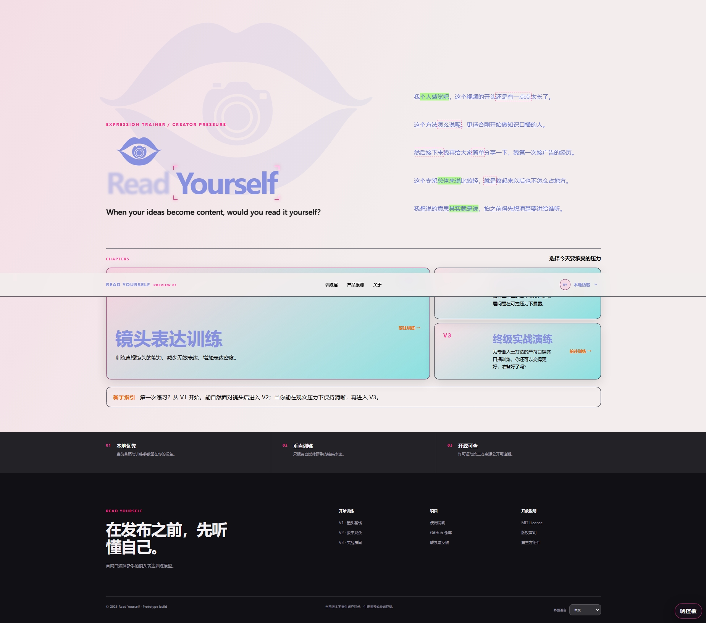

# Read Yourself

对着镜头讲一段话，讲完就能看见自己哪儿卡壳、哪儿重复。

[打开网站](https://read-yourself.com)　·　摄像头和麦克风都在你这台电脑上，默认不上传。



## 这是给谁的

刚做口播、直播、知识分享的人。一开摄像头就忘词、不敢看镜头，讲完自己都不知道哪儿不对劲。

不是课程，也不帮你运营账号，就是一块能反复练的地方。

## 你能练什么

- **对着镜头讲一段，长短都行。** 自己出题，或用账号介绍、知识口播、观点、经历这类现成题。
- **口头禅、重复一眼能看到。** 讲的时候有字幕，「嗯、那个、其实」会被标出来，不用事后凭感觉。
- **提前适应被盯着讲。** 能加数字观众，模拟被看着讲的压力；同一题再讲一遍，能对比两次差别。
- **练真会碰到的场面。** 广告植入、热点表态、直播回应、知识口播，都能拿来当题练。
- **想录下来回看也行。** 视频只存在你自己电脑上，不自动上传。

浏览器打开就能试。要完整的离线识别和本机分析，用 Windows 桌面版。

## 怎么试

1. 打开 [read-yourself.com](https://read-yourself.com)
2. 从「镜头基线」开始，允许摄像头和麦克风
3. 选一个题，讲完看字幕，看哪些词被标了出来

桌面版（离线语音识别，约 1GB 模型，只存在你电脑上）：

```powershell
npm install
powershell -ExecutionPolicy Bypass -File .\scripts\setup-asr-model.ps1
npm start
```

仓库技术名是 Expression Trainer · Creator Pressure。项目继承 [fxy2311-youyou/expression-trainer](https://github.com/fxy2311-youyou/expression-trainer)。下一阶段见 [`docs/roadmap/2026-09-next-stage.md`](docs/roadmap/2026-09-next-stage.md)。

## 桌面端运行

环境：Windows 10/11、Node.js 22.12 或更高版本。

```powershell
npm install
powershell -ExecutionPolicy Bypass -File .\scripts\setup-asr-model.ps1
npm start
```

模型安装脚本会从 sherpa-onnx 官方发布页下载约 1 GB 的中英双语流式 Paraformer 模型。模型保存在本机 `models/`，已被 `.gitignore` 排除，不随仓库分发。

桌面端提供：

- Sherpa-ONNX 本地麦克风转写，不依赖浏览器语音服务。
- 原项目的笼统词、填充词、犹豫词、重复表达与表达密度分析。
- 训练菜单中的“原始诊断模式”“训练规则”和“大模型配置”。
- OpenAI、DeepSeek、Ollama 及兼容 OpenAI 接口的自定义服务。
- 本地诊断兜底；配置模型后追加实时 AI 建议和完整复盘。

## 浏览器预览

直接打开 `index.html`，或用静态服务器访问本目录。浏览器模式用于快速验收 UI、摄像头、受众模板和场景流程；它会降级使用 Web Speech API 与本地 JavaScript 词库，不能替代桌面端的离线诊断核心。为避免浏览器反复请求麦克风权限，每轮只启动一次 Web Speech；服务提前结束时会明确提示，不会自动无限重启。

面向公开网站的跨浏览器字幕可选用同域 Cloudflare Pages Function：启用后，网页每约 3 秒向 Cloudflare Workers AI Whisper 发送一个纯音频分段并得到字幕，解决 macOS 浏览器“麦克风正常、字幕不出现”的 Web Speech 差异。该通道默认**关闭**，启用前必须完成隐私说明、成本与访问控制评估；配置方法和人工验收见 [docs/stt/web-stt-cloudflare.md](docs/stt/web-stt-cloudflare.md)。

## 开发与验证

```powershell
npm run check
npm test
npm run smoke
```

- `check`：检查桌面主进程、预加载脚本、训练界面和诊断核心语法。
- `test`：验证表达分析、受众引擎、词库、自定义口癖词、提示词和 ASR 状态契约。
- `smoke`：启动真实 Electron 渲染器，验证 V1、预加载桥接和离线模型状态。

## 人工验收调控板

每个训练页面右下角都有仅供开发阶段使用的调控板。输入会先自动保存在当前浏览器的 `localStorage`，普通刷新不会丢失：

- “UI 参数”：能力开关、颜色、字体、画布、布局和元素位置/尺寸。
- “色彩方案”：5 套基于 Radix Colors（MIT）的全局与 V3 Studio Token 预设；选定后仍可回到 UI 参数逐色微调。
- “文案”：管理当前页面全部可见静态文案和浏览器标题。
- “Drift Wall”：只管理数字观众默认预览背景。
- “页面过渡”：管理 Scroll Expand 与四向随机背景接力。
- “Vertical Marquee”：独立管理首页右上角的 Magic UI 纵向表达流。现在每组只占一个阅读位置：默认显示口播原句，鼠标悬停或键盘聚焦后通过本地 Gooey SVG 滤镜换成优化句；可调开关、暂停、方向、悬停暂停、循环时长、重复组数、句组间距、区域高度、上下渐隐、字色、字号、字重、问题词标记和液化换句参数。旧“逐字稿封面”的字色和时长草稿继续兼容。
- “文字动效”：独立管理首页 `Read Yourself` 主标题的 True Focus 和副标题的 Warp Text。它们是 React Bits 的本地原生适配，不引入 React 或 OGL；WebGL2 不可用时副标题回退为普通可读文字。

- “Logo”：同页分为两个可独立展开的区域：标题上方的小 Logo，以及左侧背景大 Logo。小 Logo 保留已有显示、颜色、不透明度、等比宽度、对齐、标题间距和 X/Y 偏移，始终静态；背景大小和位置以左区百分比调节，超出部分裁切、不撑大页面。两者均可跟随主题或独立选色，各自重置不会影响另一方，参数共同纳入项目文件／JSON 保存。原始图保存在 `assets/brand/read-yourself-concentric.png`，保持不变，动态图层也从该图通过 SVG 遮罩分离，不生成另一套外形。

### 背景 Logo 的两版动效

路径：**调控板 → Logo → 02 · 背景大 Logo → 切换动效**。

- **动效 1 · 瞳孔相机在眼眶内跟随**（默认）：眼睛／嘴唇外轮廓固定，相机始终正对用户，在眼眶安全范围内平滑移动。可调水平幅度、纵向比例与移动时缩放。
- **动效 2 · 镜头内圈跟随鼠标**：外轮廓、相机外壳和镜头外圈固定，内圈向鼠标偏移；不是圆环原地自转。可调内圈位移幅度。
- **动效 3 · 相机与镜头同时跟随**：把前两版叠加；相机在眼眶内移动的同时，镜头内圈继续朝同一方向偏移。
- **随机眨眼**：独立于三版鼠标跟随。批准的外侧嘴唇／眼睑轮廓保持固定，只让上下内缘形变并在中线拼成一条平缝，不平移、交叉或叠加整片嘴唇；可调最短／最长等待、闭合速度和闭合程度，也可在调控板立即预览。
- **关闭跟随**：停止鼠标响应。两版共用“跟随柔和度”，数值越高越缓；各版幅度独立记忆。“仅恢复动效参数”不改变原有颜色、透明度、位置、尺寸。
- 跟踪范围是整个起始页（包括右侧文案、V1/V2/V3 入口和调控板），不是 Logo 的悬停区域。不监听网页外的鼠标，也不调用摄像头。进入训练页不会加载该动效模块。
- 离开窗口／失焦会柔和回正；页面隐藏、滚出可视区时停止，位置稳定后不持续请求动画帧。触摸滑动不触发跟随；系统“减少动态效果”开启时显示原图。图片加载失败也保留原来的静态路径。
- 原图坐标用于分层和幅度上限，内圈最大偏移 18 单位，不穿过外圈；相机纵向位移会根据缩放值自动收紧，保留上下眼睑间距。只有 `transform` 参与连续运动，原图和用户的布局参数不改动。
- 动效字段存放在 `components.logoBackground`：`motionMode`（`camera`／`lens`／`combined`／`off`）、`motionResponse`、`cameraTravel`、`cameraVerticalRatio`、`cameraScale`、`lensTravel`，以及 `blinkEnabled`、`blinkMinDelay`、`blinkMaxDelay`、`blinkDuration`、`blinkDepth`。旧配置只补齐新字段，不覆盖既有 Logo 参数；全局 JS/JSON 保存包含全部字段。
- `blinkDepth` 小于 `1` 时表现为不完全闭眼；默认值 `1` 才会完全汇成平缝。

所有分页共用调控板底部的固定保存栏，不需要逐页保存：
- **保存全部参数到项目**：包含功能开关、主题、布局、所有组件、文案、fineTune 元素样式与 extraCopy 内容修改，以及同一份草稿中已有的其他页面配置。桌面开发版直接写入仓库根目录 `creator-project-config.js`；支持目录授权的浏览器首次选择项目根文件夹（含 `index.html`、`package.json`），以后直接覆盖该目录下同名 JS。可在保存栏的“保存位置”中更换目录；绑定目录不等于立即保存，不会改动草稿。
- **导出全部参数 JSON**：桌面开发版或已绑定目录的浏览器，固定覆盖 `docs/creator-pressure-config.json`。JSON 是备份，不参与页面加载；要更新页面默认参数，请保存 JS。两种操作都不会自动提交 GitHub。
- **目录记忆与兼容**：目录授权保存在此浏览器、此站点的 IndexedDB，不随参数导出。浏览器可能要求重新授权；清除站点数据或换端口后需重新绑定。不支持目录授权的浏览器退回“另存为”或下载，并明确提示手动替换；单独另存为使用独立文件选择器 ID，以便浏览器记住 JS/JSON 各自的位置。选择其他项目副本不会更新当前服务器所服务的副本，请选实际预览项目。
- **浏览器草稿**：输入即自动保存，但只属于当前浏览器/网页地址，并非账户云同步。不同地址、端口、浏览器中的草稿不会自动合并。请从实际完成调试的那个页面导出。
- 图片保存已配置的引用或内嵌内容，不会自动下载远程素材、上传本地图片路径。API 密钥、录音、设备连接配置与调控板的设备级拖动位置不在公开项目导出范围内。

表达流使用本地适配的 Magic UI Marquee（MIT），无需网络、React 或新增 npm 依赖。它只展示可编辑的精简示例，不调用大模型、不制造事实或模拟实时分析。普通句中的 `[[词语]]` 默认在细下划线、背景高亮和虚线框之间逐处独立随机抽取，允许连续抽到同一种；刷新或重建内容时重新抽取，悬停期间不闪变。旧草稿一次性启用随机样式，保留文案和配色，之后仍可手选固定样式。优化句中的 `[[词语]]` 使用关键词强调色；页面不显示“原句/精炼”标签。

悬停时表达流暂停，同一位置液化换句；移开时恢复原句并继续滚动。键盘聚焦直接展示优化句，回车/空格切换，触屏点击切换。重复播放的副本同样可以悬停。滤镜只在过渡中生效，结束后完整显示清晰文字。Warp Text 支持多行副标题和实时改文案；减少动态效果或 WebGL2 不可用时保留普通文字。

按项目所有者明确选择，默认**打开即自动循环**，不由滚轮驱动；鼠标移入文字区域暂停，移开继续。页面没有播放/暂停按钮。调控板 → Vertical Marquee → 播放模式提供“自动循环播放 / 跟随系统动态偏好 / 静态阅读”。只有跟随系统模式在系统减少动态效果时停止，静态模式始终可手动阅读；自动模式是仅针对本组件的播放选择，不改变系统或其他组件。悬停暂停可在该页关闭；旧草稿会迁移为悬停暂停，字色、文案和速度保持不变。点击文字不会再锁住动画。

### 四页元素精调

- **UI 参数 → 本页全元素精调**：点击“点选页面元素”，再点击实际界面；这次点击只选择，不会开启摄像头、开始训练或跳转。也可按文字/ID 搜索，在列表中选择尚未展开的弹窗元素。新出现的内容点击“刷新元素列表”后可选。
- 分组调节颜色、字体大小、字重、行高、尺寸、X/Y、内外边距、间距、边框、透明度、SVG 颜色；可单独选择悬停、键盘焦点、选中、禁用、`::before` 或 `::after`。
- **文案 → 遗漏文案与占位提示**：支持带子标签的文字、输入占位、悬停提示、图片说明、无障碍名称及 V3 场景训练题。编辑只替换文字节点，保留内部图标、小字和控件；CSS 装饰文字在此区域底部展开编辑。
- 修改按页面保存到同一份浏览器草稿；“保存到项目”同时导出 `fineTune` 和 `extraCopy`。单个属性留空或点击 ↺ 恢复原样；支持只恢复所选元素，不影响其他设置。
- 边界：实时 STT、诊断数值、训练状态、观众反应等运行结果不允许被伪造，外观仍可编辑。输入内容和 API Key 不被读取/导出。Marquee 句子在专用页管理；摄像头影像、浏览器/操作系统原生弹窗、外部数字人服务内部画面和调控板自身不属于页面元素编辑范围。
- 个性化保存的是 CSS 覆盖，不会改写源码结构或训练算法。大幅位置/尺寸改动可能破坏响应式布局；可随时恢复单元素。动态列表中的精调按结构位置生效；若要统一整类组件，请用它的专用参数页。

自动化覆盖记录和人工验收清单见 `docs/qa-editability-audit.md`。`jsdom` 仅作为开发测试依赖，不进入浏览器运行时。

所有分页底部的固定保存栏提供两种长期保存方式：

- 桌面开发版点击“保存到项目”，会直接更新根目录的 `creator-project-config.js`。
- 浏览器预览首次点击“保存到项目”，选择实际预览项目的根文件夹并授权；以后直接覆盖其中的配置，无需反复在文档/下载目录寻找文件。若浏览器不支持目录授权，则退回另存为或下载。
- “导出全部参数 JSON”固定保存到绑定目录的 `docs/creator-pressure-config.json`；JS 项目配置被四个页面共同加载，JSON 只作备份。两者均可提交 Git。

正式用户环境将页面设为 `<body data-environment="production">` 后，调控板不会初始化；LiveTalking 地址、Avatar ID 等开发者字段也不会暴露。

## 数据与隐私边界

- 默认不录制、不上传摄像头画面。
- Electron 语音转写在本机执行；只有明确配置并启用大模型时，文字内容才会发送给相应服务商。
- 网页 Whisper 转写默认关闭；若项目所有者按 `docs/stt/web-stt-cloudflare.md` 明确启用，音频分段会发送给 Cloudflare Workers AI，仅用于返回字幕，不包含摄像头画面。
- 当前不使用视觉模型判断视线，也不进行颜值、人格、情绪或可信度评分。
- 设置仍沿用上游的本地 JSON 存储方式；正式发布前应迁移 API Key 至 Electron `safeStorage` 或系统凭据库。

## 来源、许可证与第三方材料

本仓库使用 MIT License，并保留上游作者 Sisi 的版权声明。Creator Pressure 的新增改动由 chujiachen167-ui 维护。

- [LICENSE](LICENSE)：本仓库 MIT 许可证与双方版权声明。
- [NOTICE.md](NOTICE.md)：上游来源、基准提交和主要改动。
- [THIRD_PARTY_NOTICES.md](THIRD_PARTY_NOTICES.md)：Electron、sherpa-onnx、React Bits、LiveTalking、词库与演示素材边界。
- [UI_REFERENCE.md](UI_REFERENCE.md)：界面参考与未复制内容。
- [ARCHITECTURE.md](ARCHITECTURE.md)：当前实现结构和能力边界。

注意：离线模型、词库数据和运行时远程图片可能具有独立许可证。本仓库不会借由 MIT 声明覆盖这些第三方材料的许可条件；生产分发前必须按第三方清单逐项复核。
